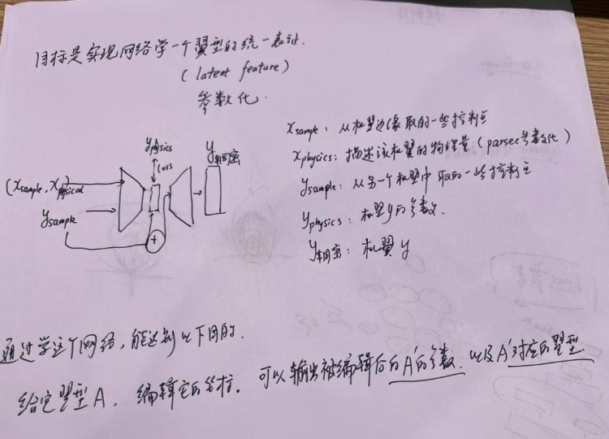

# 使用说明：

## 模型的总体预览图

## 环境配置

> pip install -r requirements.txt

## 基础的encoder - decoder

输入：N个点 (N,2)

输出：N个点 (N,2)

> python train.py # 训练模型

> python infer.py # 测试模型

## 基础的基于物理量重建

输入：n （n = N/10）个关键点 + 8个物理量  {'input':input,'output':data,'params':params}

输出：N个点 (N,2)

> python train_parsec.py # 训练模型

> python infer_parsec.py # 测试模型

## 基础的基于物理量的编辑

